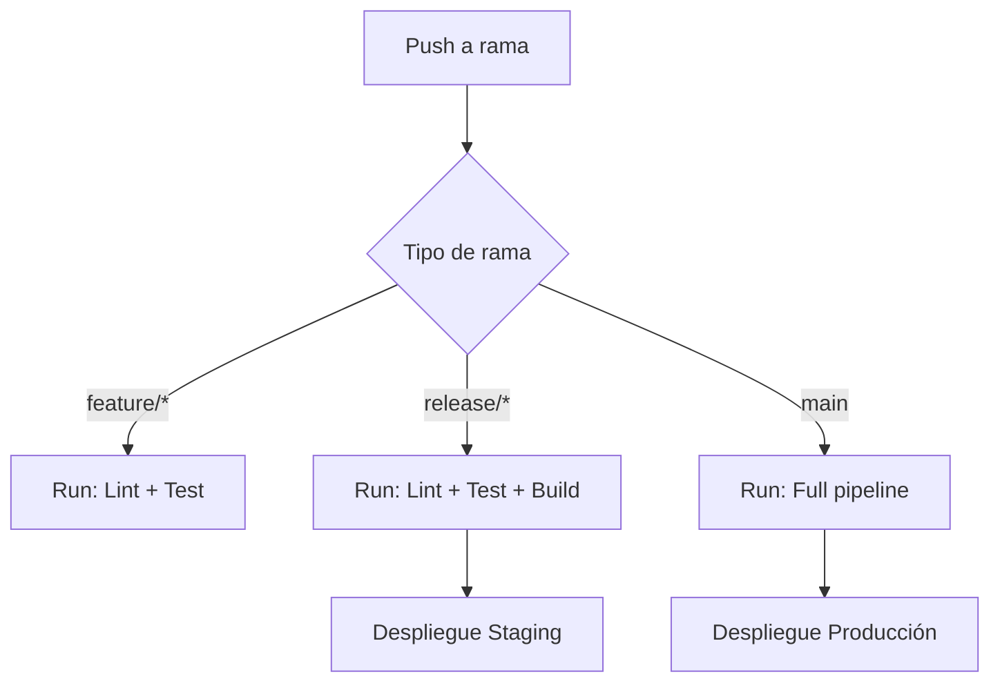

# ⚖️ CI/CD - Conceptos y Beneficios

## Definiciones

- **Integración continua (CI)**: Automatiza pruebas y validaciones al hacer push al repositorio.
- **Despliegue continuo (CD)**: Automatiza el paso de versiones a entornos de staging o producción.

## Beneficios

- Detectar errores rápidamente
- Reducir trabajo manual
- Entregas más seguras y frecuentes

## 🎟️ Diagrama del pipeline CI/CD

