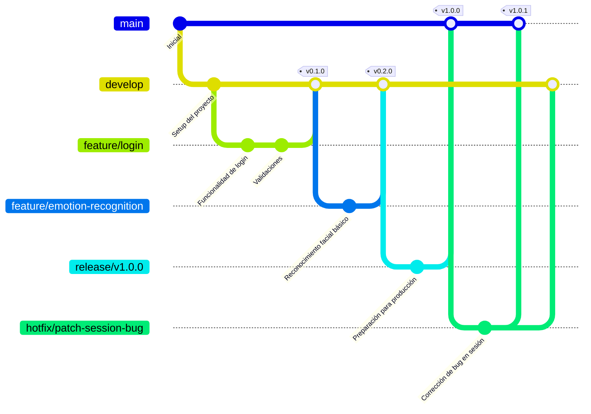

# Diagrama de flujo de ramas (GitFlow)

## 📁 Convención de nombres de ramas

### Prefijos por tipo:
- **feature/** - para nuevas funcionalidades
- **release/** - para preparación de versiones
- **hotfix/** - para correcciones urgentes
- **bugfix/** - para correcciones menores no urgentes
- **test/** - para experimentación o pruebas

### Ejemplos:
- `feature/login-google`
- `release/2.0.0`
- `hotfix/fix-prod-db`

## 🗒️ Convención de Commits

### Estructura sugerida:
`tipo: descripción breve del cambio`

### Tabla de commits:

| Tipo | Descripción |
|------|-------------|
| feature | Nueva funcionalidad |
| fix | Corrección de error |
| refactor | Refactor de código |
| docs | Cambios en documentación |
| remove | Eliminación de código o archivos |
| test | Añadir/modificar pruebas |
| deploy | Preparación o acciones de despliegue |